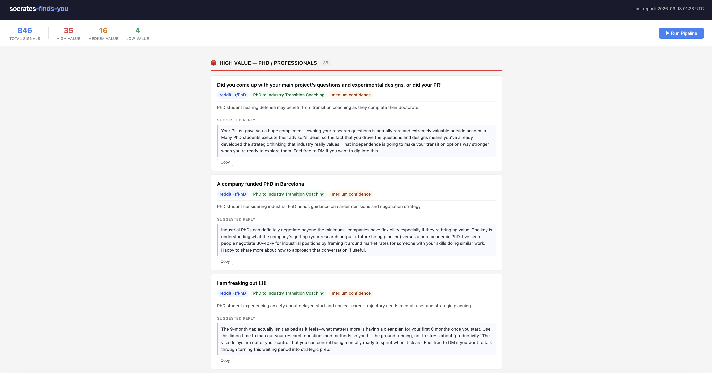

# socrates-finds-you

> An automated pipeline that finds people who need STEM, AI, and career mentorship — before they find you.

Scrapes LinkedIn, Blind, Reddit, Hacker News, RSS feeds, and The Grad Cafe for coaching signals, uses **Claude AI** to match each post against a service menu, and delivers a ranked daily Markdown report with a local web dashboard.

**You focus on outreach. The pipeline handles discovery.**

---

## How It Works

```
Scrapers (9 platforms) → SQLite → Claude API Matcher → Daily Report + Web UI
```

**Three phases run end-to-end with a single command:**

1. **Scrape** — Pull posts and discussions from up to 9 platforms using Playwright, public APIs, and RSS
2. **Match** — Claude evaluates each signal against the service menu in batches of 10, returning `service_match`, `client_tier`, `confidence`, `reasoning`, and a `suggested_reply` — a ready-to-send Reddit reply written in a natural, non-salesy tone
3. **Report** — Ranked Markdown report written to `output/report_YYYY-MM-DD.md`, plus a live web dashboard at `localhost:8080`

---

## Screenshot

> _Web dashboard — leads grouped by tier with service match, confidence, and reasoning_



```
# socrates-finds-you — Daily Report 2026-03-16

**6 leads matched** — 2 high / 4 medium / 0 low value

## 🔴 High Value (PhD / Professionals)

### 1. How do academics actually find jobs abroad?
- Platform: reddit · r/AskAcademia
- Service: PhD to Industry Transition Coaching
- Confidence: medium
- Why: Partner of academic seeking RAP positions abroad suggests potential career transition guidance need.
- Link: https://reddit.com/r/AskAcademia/comments/...
```

---

## Platforms Covered

| Priority | Platform | Client Tier | Method | Status |
|----------|----------|-------------|--------|--------|
| ⭐⭐⭐ | LinkedIn | Highest — PhD / professionals | Playwright | ✅ Active |
| ⭐⭐⭐ | Blind | Highest — big tech workers | Playwright | ✅ Active |
| ⭐⭐ | Hacker News | Mid-high — technical professionals | Firebase REST API | ✅ Active |
| ⭐⭐ | Substack / Medium | Mid-high — career changers | RSS (feedparser) | ✅ Active |
| ⭐⭐ | Reddit (11 subreddits) | Mixed — PhD to high school | Public JSON API | ✅ Active |
| ⭐ | The Grad Cafe | Mid — PhD students in limbo | requests + HTMLParser | ✅ Active |
| ⭐ | 小红书 | Mid — Chinese-speaking diaspora | Playwright | 🔧 Stub |
| — | Twitter/X | High | tweepy | ⛔ Disabled (API cost) |

**Reddit subreddits monitored:** r/PhD, r/AskAcademia, r/datascience, r/MachineLearning, r/cscareerquestions, r/learnmachinelearning, r/GradSchool, r/SAT, r/ApplyingToCollege, r/learnpython

---

## Tech Stack

| Layer | Choice |
|-------|--------|
| Language | Python 3.11+ |
| Browser automation | Playwright (sync API, `headless=False`) |
| HTTP scraping | requests + feedparser |
| Database | SQLite — `data/signals.db` |
| AI matching | Anthropic SDK — `claude-sonnet-4-5` |
| Web UI | Flask |
| Output | Markdown reports in `output/` |

---

## Quick Start

**Step 1 — Install**

```bash
git clone https://github.com/dongzhang84/socrates-finds-you
cd socrates-finds-you

python3 -m venv .venv && source .venv/bin/activate
pip install -r requirements.txt
playwright install chromium
```

**Step 2 — Configure**

```bash
cp .env.example .env
# Open .env and add your ANTHROPIC_API_KEY (only key required for the free mode)
```

**Step 3 — Initialize and run**

```bash
python3 storage/db.py  # create the database (one-time)
python3 main.py        # scrape + match + generate report (full pipeline)
```

**Step 4 — Open the dashboard**

```bash
python3 app.py               # → http://localhost:8080
```

That's it. The dashboard shows your matched leads sorted by tier. Hit **Run Pipeline** to trigger a fresh scrape from the browser.

---

## Daily Use

Once set up, your workflow is:

```bash
# Option A: use the web dashboard (recommended)
python3 app.py
# Then click "Run Pipeline" on the page — runs the full pipeline, streams the log, reloads when done.

# Option B: run from the terminal
python3 main.py                    # full pipeline (LinkedIn, Blind, HN, RSS, Reddit, Grad Cafe)
python3 main.py --reddit-only      # free, no browser, ~2 min
python3 main.py --high-value-only  # LinkedIn + Blind only (browser required)
```

**All pipeline flags:**

| Flag | What runs | Credentials needed |
|------|-----------|--------------------|
| `--reddit-only` | HN + RSS + Reddit + Grad Cafe | `ANTHROPIC_API_KEY` only |
| `--no-browser` | Same as above | `ANTHROPIC_API_KEY` only |
| `--high-value-only` | LinkedIn + Blind | + LinkedIn + Blind accounts |
| _(none)_ | All active platforms | All credentials |
| `--no-scrape` | Skip scraping, re-run matching on existing data | `ANTHROPIC_API_KEY` |
| `--report-only` | Regenerate report from already-matched signals | None |
| `--fix-replies` | Generate `suggested_reply` for matched signals missing one | `ANTHROPIC_API_KEY` |

Reports are saved to `output/report_YYYY-MM-DD.md`. Each run deduplicates automatically — running twice a day is safe.

---

## Adapting for Your Own Use Case

This project is hard-coded for one person's coaching business. Here's exactly what to change to make it yours.

### 1. Change what Claude looks for — `matcher/claude_match.py`

Open `matcher/claude_match.py` and find the `SYSTEM_PROMPT` string near the top. Replace the services list with your own:

```python
SYSTEM_PROMPT = """You are a matching assistant for [Your Name].

He/she offers these services:

HIGH VALUE ([your high-value client type]):
- [Service A]
- [Service B]

MEDIUM VALUE ([your medium-value client type]):
- [Service C]

LOWER VALUE ([your lower-value client type]):
- [Service D]
"""
```

Claude will then match every scraped post against your services and return `service_match`, `client_tier`, `confidence`, and a one-line `reasoning`.

### 2. Change where it looks — `main.py`

Open `main.py` and update the keyword/subreddit constants at the top of the file:

```python
# Keywords for LinkedIn search
LINKEDIN_KEYWORDS = [
    "your keyword",
    "another keyword",
]

# Subreddits to monitor (grouped by value tier in comments)
REDDIT_SUBREDDITS = [
    "subreddit1", "subreddit2",
]

# RSS feeds (Substack, Medium, newsletters)
RSS_FEEDS = [
    "https://yournewsletter.substack.com/feed",
]
```

These are the only two files you need to edit. Everything else — scraping, storage, matching, reporting, the dashboard — works without changes.

---

## Web Dashboard

```bash
python3 app.py    # → http://localhost:8080
```

- Matched leads from the last 48 hours, grouped by tier
- Per-lead: title (clickable link), platform, service match, confidence, reasoning, and a **suggested reply** with a one-click Copy button
- **Run Pipeline** button — runs the full pipeline, streams the live log, auto-reloads when done
- Stats bar: total signals in DB, high / medium / low counts
- **LinkedIn — All Signals** section — shows every LinkedIn signal (matched or not) with title, author, body snippet, and matched status

---

## Project Structure

```
socrates-finds-you/
├── scrapers/
│   ├── linkedin.py          # Playwright — login + keyword search + JS DOM traversal
│   ├── blind.py             # Playwright — Career/Job channels, 7-day window
│   ├── hackernews.py        # Firebase REST API, concurrent fetch (ThreadPoolExecutor)
│   ├── rss.py               # feedparser via requests (macOS SSL workaround)
│   ├── reddit.py            # Public reddit.com/r/{sub}/new.json — no auth needed
│   ├── gradcafe.py          # HTMLParser state machines, Forums 72 + 21
│   ├── twitter.py           # tweepy (disabled — API credits)
│   └── xiaohongshu.py       # Playwright stub
├── matcher/
│   └── claude_match.py      # Claude API semantic matching, batches of 10
├── storage/
│   └── db.py                # SQLite — init, save, get_unmatched, update, report
├── reporter/
│   └── daily_report.py      # Markdown report generator, tier-sorted
├── docs/
│   ├── 01-services.md       # Full service menu
│   ├── 02-platforms.md      # Platform priority rationale
│   └── implementation-guide.md  # Build notes, lessons learned, actual selectors
├── output/                  # Daily reports — gitignored
├── data/                    # SQLite database — gitignored
├── app.py                   # Flask web dashboard
├── main.py                  # Pipeline entry point
├── requirements.txt
└── .env.example
```

---

## Environment Variables

Copy `.env.example` to `.env` and fill in the values you need. Only `ANTHROPIC_API_KEY` is required for the free-scraper mode (`--reddit-only`).

```bash
# Required
ANTHROPIC_API_KEY=sk-ant-...          # Claude API key

# LinkedIn scraper (headless=False, personal account)
LINKEDIN_EMAIL=you@example.com
LINKEDIN_PASSWORD=...

# Blind scraper (headless=False, personal account)
BLIND_EMAIL=you@example.com
BLIND_PASSWORD=...

# Twitter/X — disabled by default (API credits)
TWITTER_BEARER_TOKEN=...

# Reddit — reserved (not used; scraper uses public .json API)
REDDIT_CLIENT_ID=...
REDDIT_CLIENT_SECRET=...
REDDIT_USER_AGENT=socrates-finds-you/1.0

# 小红书 — stub, not yet active
XIAOHONGSHU_PHONE=+1...
XIAOHONGSHU_PASSWORD=...
```

> All credentials stay on your local machine. This tool is never deployed to a server.

---

## Database Schema

```sql
CREATE TABLE signals (
    id               TEXT PRIMARY KEY,   -- "{platform}:{external_id}"
    platform         TEXT NOT NULL,
    external_id      TEXT NOT NULL,
    url              TEXT NOT NULL,
    title            TEXT NOT NULL,
    body             TEXT,
    author           TEXT,
    subreddit        TEXT,               -- Reddit only
    posted_at        DATETIME,
    scraped_at       DATETIME DEFAULT CURRENT_TIMESTAMP,

    -- Matching results (set by Claude)
    matched          BOOLEAN DEFAULT FALSE,
    service_match    TEXT,               -- e.g. "PhD to Industry Transition Coaching"
    client_tier      TEXT,               -- "high" | "medium" | "low"
    confidence       TEXT,               -- "high" | "medium" | "low"
    reasoning        TEXT,               -- one-sentence explanation
    suggested_reply  TEXT,               -- ready-to-send Reddit reply (2-4 sentences)

    -- Tracking
    included_in_report  BOOLEAN DEFAULT FALSE,
    actioned            BOOLEAN DEFAULT FALSE,

    UNIQUE(platform, external_id)
);
```

---

## Services Matched

Claude evaluates each signal against this menu:

**High Value** — PhD students, professionals
- PhD to Industry Transition Coaching
- AI Career Path Planning
- Applied AI Project Coaching for Career Switchers
- AI Upskilling for Professionals

**Medium Value** — College students, early-career
- AI / ML Learning Path Coaching
- College-Level STEM Tutoring
- Research / Independent Project Coaching

**Lower Value** — High school students, parents
- AI Project Mentorship for High School Students
- AP / SAT / ACT Math Tutoring
- AI Literacy for Students

---

## Cost Estimate

| Component | Cost |
|-----------|------|
| Claude API (~150 signals × ~500 tokens/run) | ~$0.05–$0.20/run |
| Reddit, HN, RSS, Grad Cafe | Free |
| LinkedIn, Blind, 小红书 (personal account) | Free |
| Twitter/X API | Disabled — too expensive |
| **Monthly estimate (daily runs)** | **~$1–6/month** |

---

## Caveats

- **LinkedIn and Blind** require `headless=False` and a real account. Both have anti-bot detection. Run at most once per day.
- **LinkedIn DOM** changes frequently — if it breaks, run `python scrapers/linkedin.py --debug` to capture the current HTML and update selectors.
- **Twitter/X** is fully implemented (`scrapers/twitter.py`) but commented out in `main.py`. Re-enable by uncommenting `TWITTER_QUERIES` and the scraper call in `run_scraping()`.
- This is a personal local tool, not a SaaS product. No auth, no deployment, no database server.

---

## License

MIT
